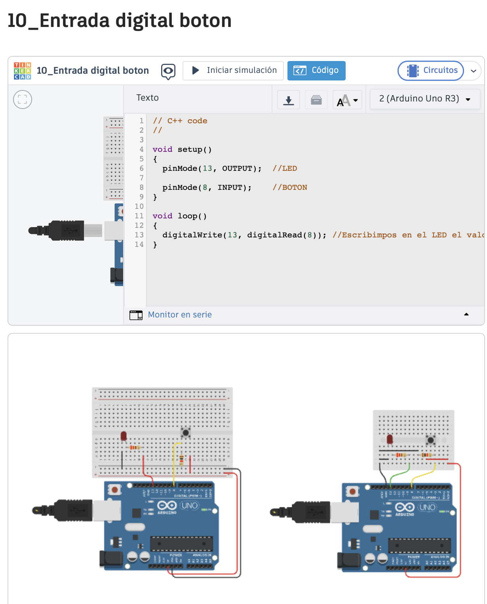
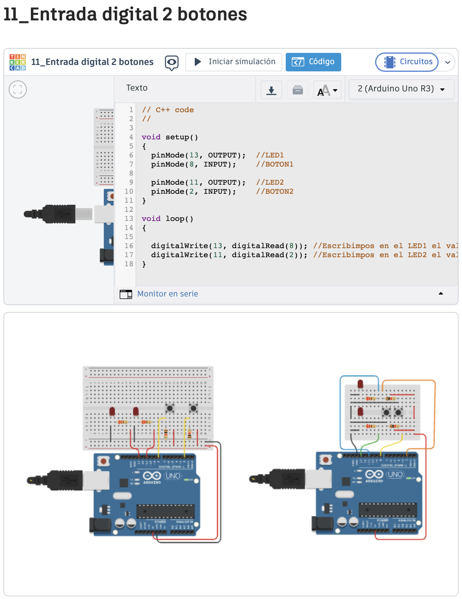
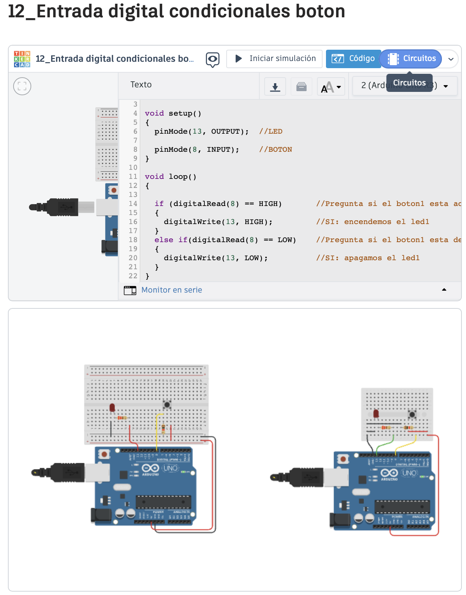
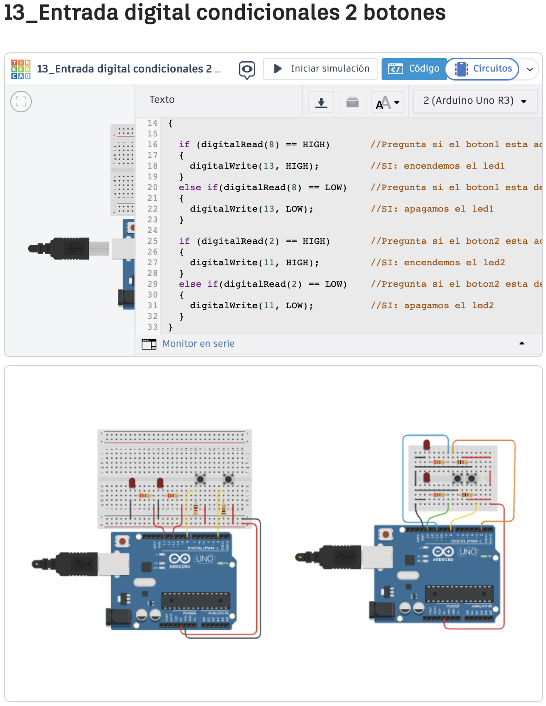
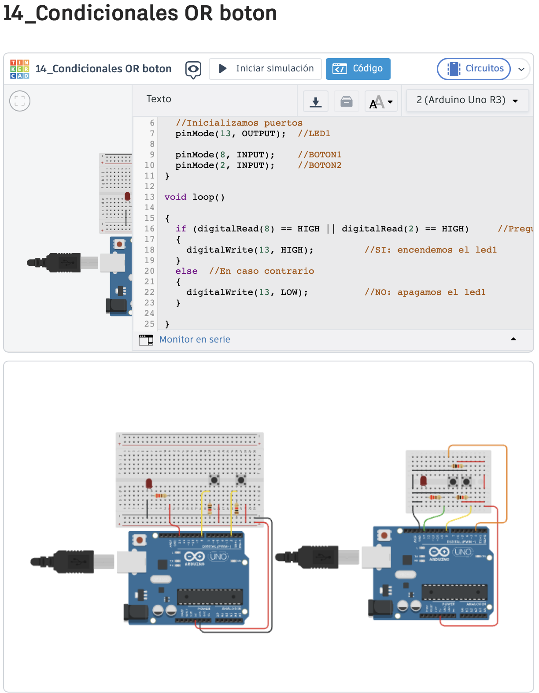
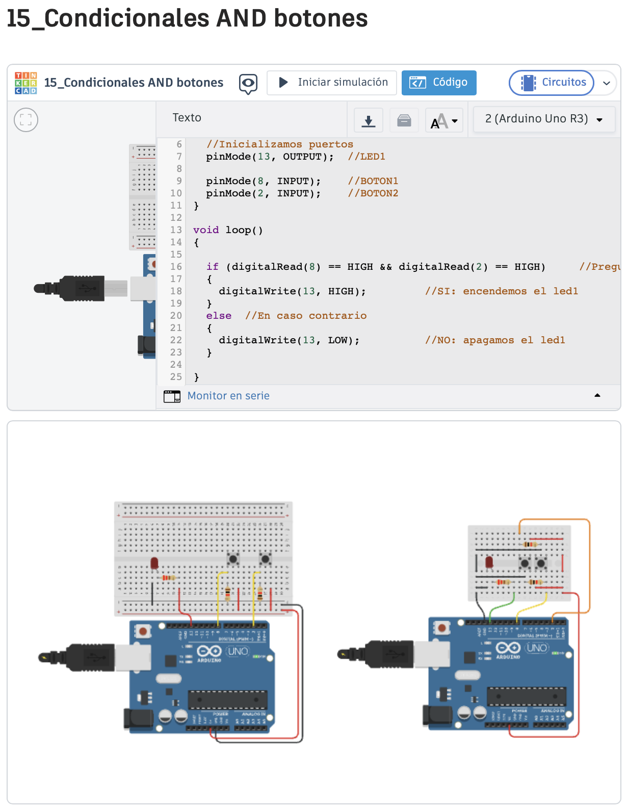
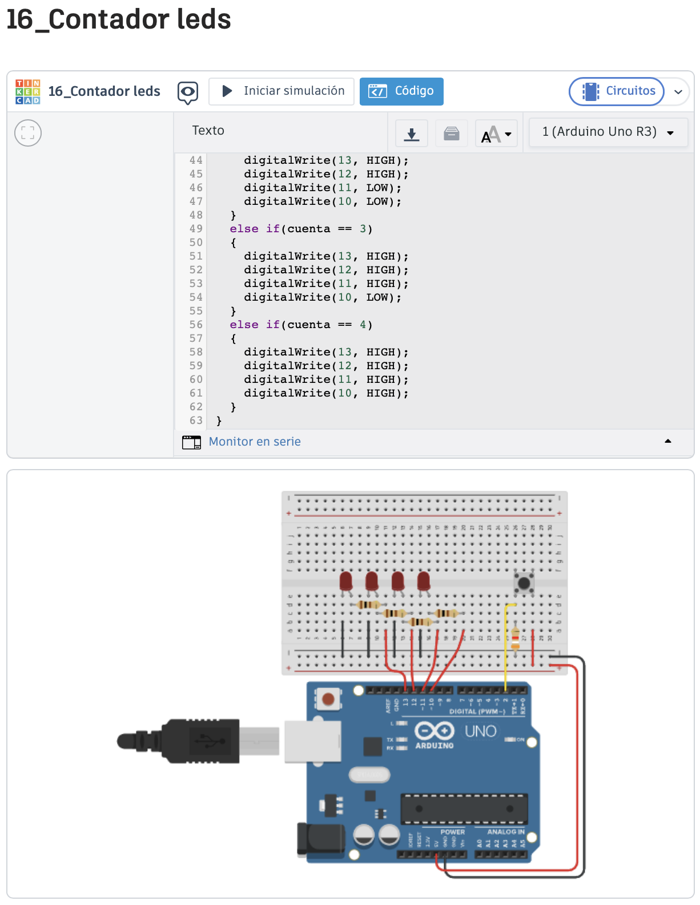

# Arduino

Arduino Básico Salidas Digitales:

- **10_Entrada digital boton** 
Foto:
 

Codigo:
 

Video:
 

- **11_Entrada digital 2 botones** 
Foto:

Codigo :
 

Video:
 

- **12_Entrada digital condicionales boton**
Foto:

Codigo :
 

Video:
 

- **13_Entrada digital condicionales 2 botones**
Foto:

Codigo :
 

Video:
 

- **14_Condicionales OR boton**
Foto:

Codigo :
 

Video:
 

- **15_Condicionales AND botones**
Foto:

Codigo :
 

Video:
 

- **16_Contador leds**
Foto:

Codigo :
 

Video:
 

