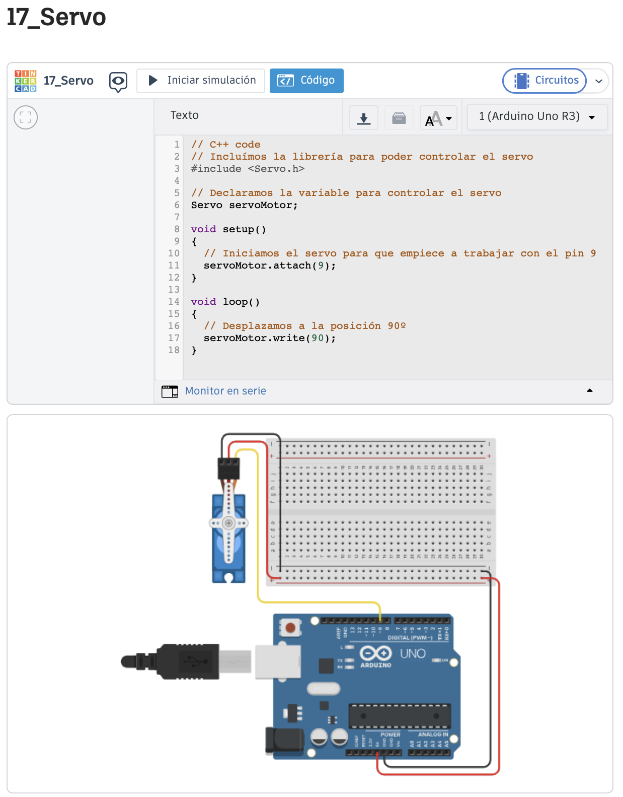
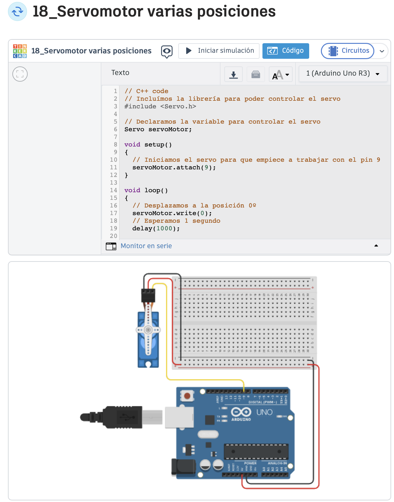
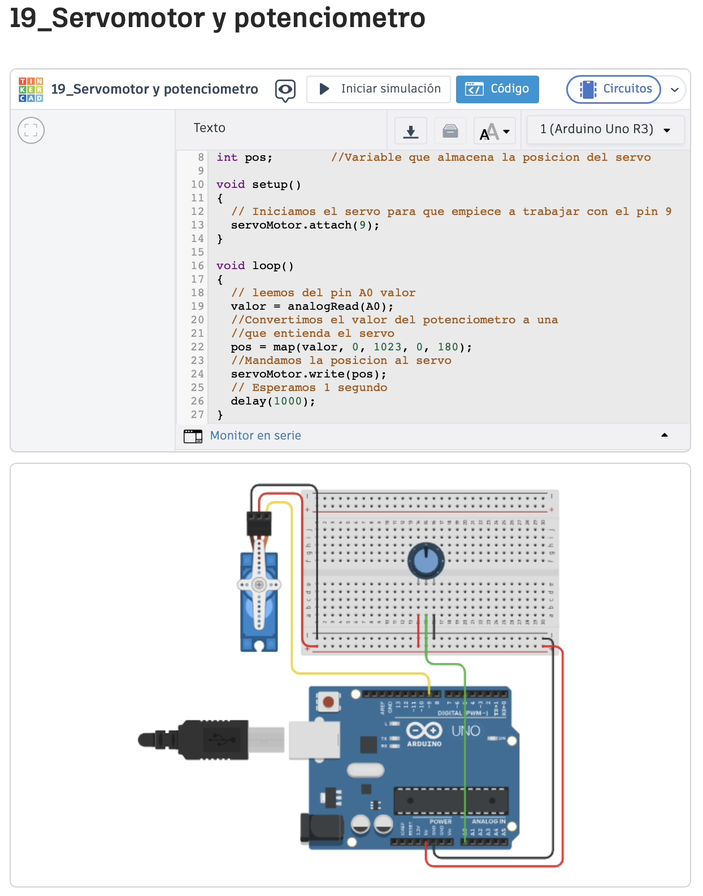
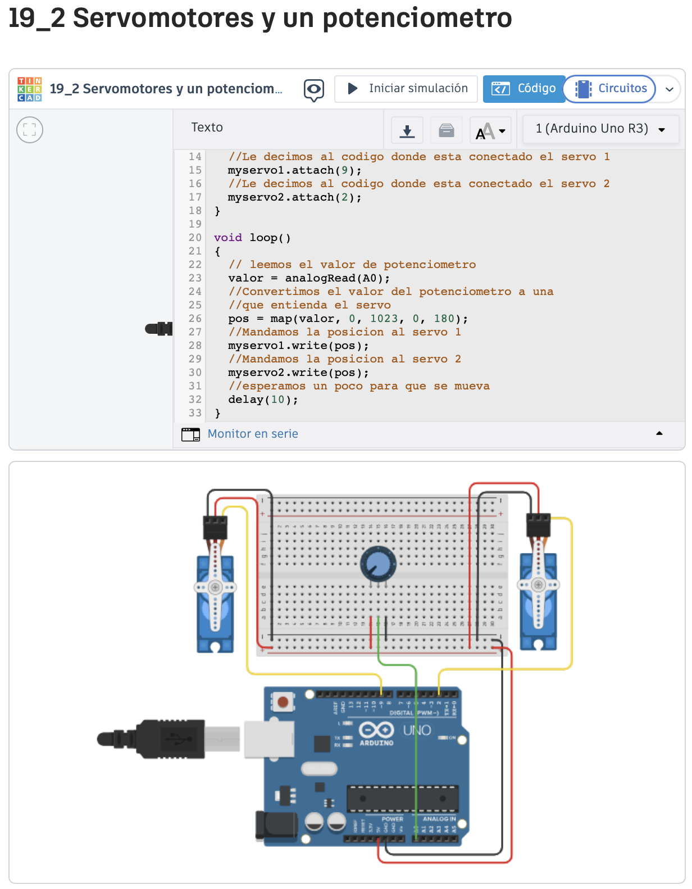
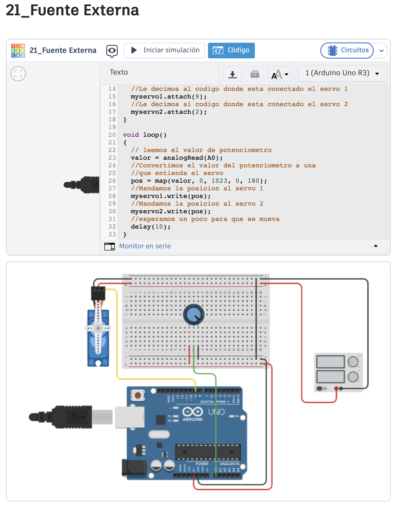

# Arduino

Arduino Básico Salidas Digitales:

- **17_Servo** 
Foto:
 

Codigo:
 

Video:
 

- **18_Servomotor varias posiciones** 
Foto:

Codigo :
 

Video:
 

- **19_Servomotor y potenciometro**
Foto:

Codigo :
 

Video:
 

- **19_2 Servomotores y un potenciometro**
Foto:

Codigo :
 

Video:
 

- **20_2 Servomotores y 2 Potenciometros**
Foto:

Codigo :
 

Video:
 

- **21_Fuente Externa**
Foto:

Codigo :
 

Video:
 

