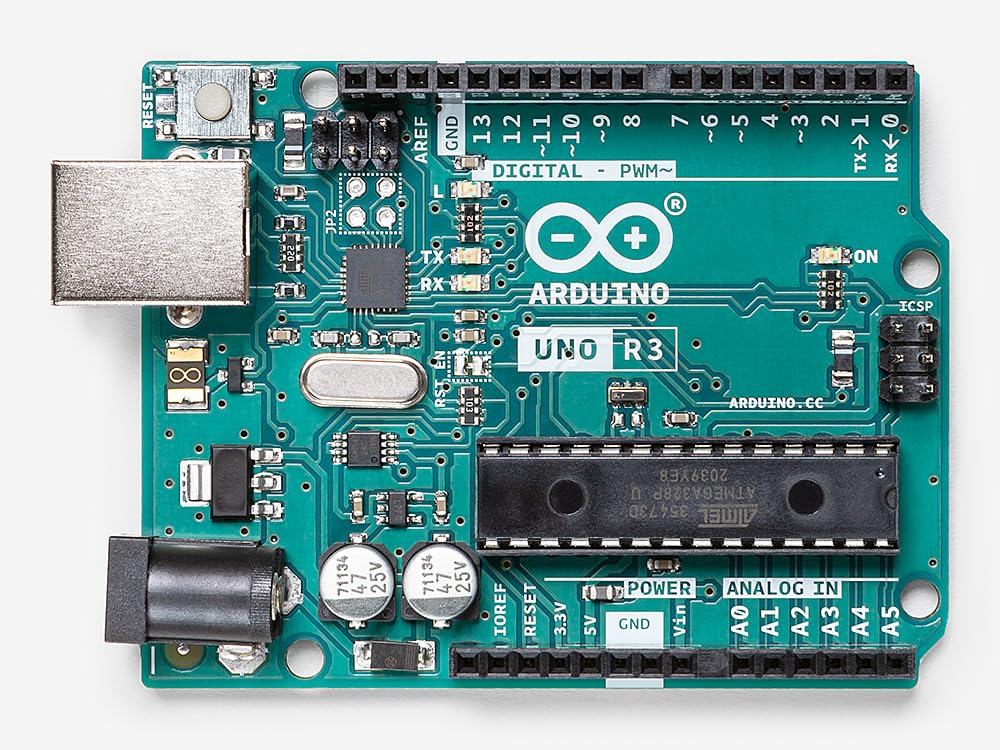
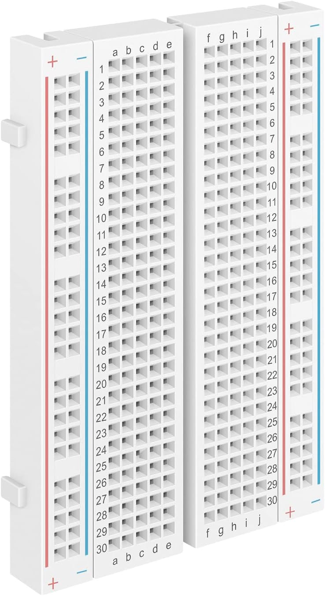
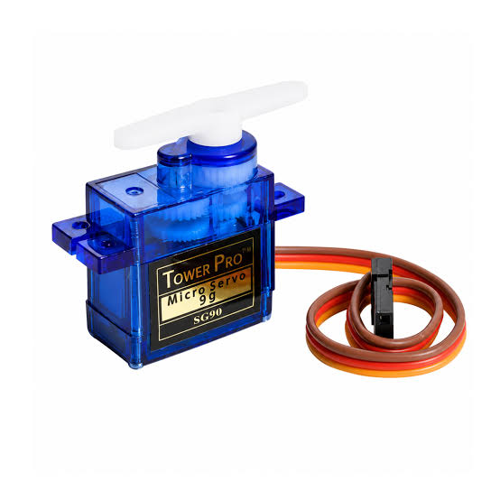
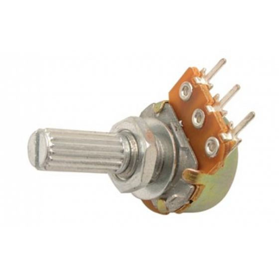
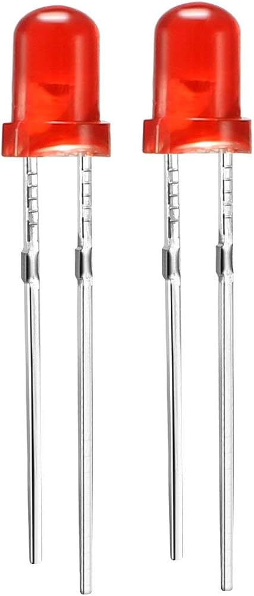
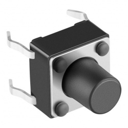
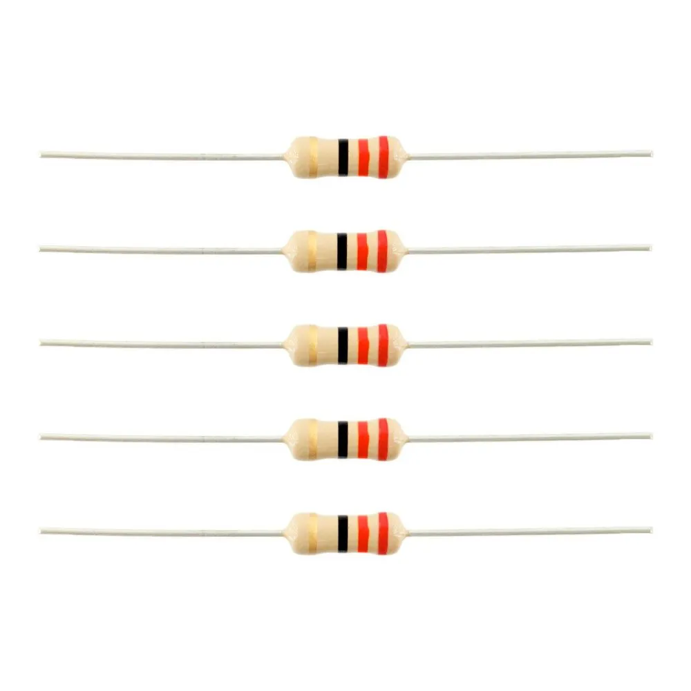

# Reporte
**El reporte debe incluir Introducción a que es Arduino y como se utiliza el programa de Arduino IDE, lista de materiales, fotos de los componentes, descripción de cada material.**

**Introducción a Arduino**
*Que es un arduino?*
Arduino es una plataforma de hardware y software libre de código abierto que se utiliza para crear proyectos electrónicos de manera sencilla. 

*Como se utiliza?*
El programa Arduino IDE se utiliza escribiendo el código de programación (llamado sketch) en su editor de texto, seleccionando después el modelo de tu placa y el puerto de conexión en el menú de herramientas, y finalmente haciendo clic en el botón "Subir" (la flecha hacia la derecha). Antes de transferirlo, el entorno compila el código para verificar que no tenga errores de sintaxis; si todo es correcto, el software traduce las instrucciones y las envía a través del cable USB directamente a la memoria de la placa Arduino, donde el programa comenzará a ejecutarse inmediatamente y de forma continua.

**Lista y descripción de materiales**
1.- Placa Arduino Uno: Es una tarjeta de desarrollo con un microcontrolador programable y se utiliza para procesar el código de programación, leer las entradas de los sensores o botones y controlar las salidas como motores y displays.

 

2.- Protoboard (Placa de pruebas): Es una base con perforaciones interconectadas internamente y se utiliza para ensamblar y conectar los componentes electrónicos de forma rápida sin necesidad de soldar.
 

3.- Servomotor: Es un motor de precisión capaz de posicionarse en ángulos específicos (de 0° a 180°) y se utiliza para generar movimientos mecánicos precisos y controlados.
 

4.- Potenciómetro: Es una resistencia eléctrica cuyo valor se puede ajustar manualmente mediante una perilla y se utiliza para enviar una señal analógica variable al Arduino para controlar componentes (por ejemplo, la posición de un servomotor).
 

5.- Diodo LED: Es un componente semiconductor de iluminación y se utiliza para mostrar estados visuales de salida (encendido, apagado, indicadores o secuencias de luces).
 

6.- Pulsador (Botón): Es un interruptor momentáneo que abre o cierra un circuito eléctrico al presionarlo y se utiliza para enviar señales o entradas digitales de control hacia el Arduino.
  

7.- Display de 7 segmentos: Es un módulo indicador compuesto por siete segmentos LED independientes y se utiliza para representar números y caracteres visualmente en las salidas digitales.
 

8.- Resistencia (Resistor): Es un componente pasivo que limita y regula el paso de la corriente eléctrica y se utiliza para proteger componentes sensibles (como los LEDs) para evitar que se quemen, o para configurar adecuadamente los botones (entradas pull-up / pull-down).
 

9.- Fuente de alimentación externa (Baterías / Suministro de energía): Es un dispositivo que provee energía eléctrica independiente y se utiliza para alimentar componentes que consumen alta corriente (como múltiples servomotores) evitando sobrecargar la placa Arduino.
 

10.- Cables de puente (Jumper Wires / Cables DuPont): Son cables conductores flexibles con pines en sus extremos y se utilizan para realizar las conexiones eléctricas entre los pines del Arduino, la protoboard y los demás componentes.
 