En este proyecto el reto fue hacer un brazo robot desde cero, creando nosotros cada una de las piezas, las cuales diseñamos en SolidWorks. Después las cortamos en la cortadora láser y este proceso lo repetimos múltiples veces ya que algunas piezas se cortaban mal, nos terminaban faltando piezas o no encajaban unas con otras. Estuvimos rediseñando y perfeccionando nuestro diseño como 4 veces. Después, una vez con todas las piezas ya cortadas, armamos el brazo e intentamos empezar a conectar el protoboard para usar el código en Arduino, pero nos pasaba que se calentaba el Arduino y no podíamos seguir porque se iban a quemar los servos. Hasta que descubrimos que era el protoboard lo que estaba fallando y ya solucionado eso logramos hacer funcionar nuestro robot.Fotos de nuestro proceso al hacer nuestro brazo robot. 

Aqui adjuntare una fotos de lo que fue el proceso de crear nuestro brazo robot:
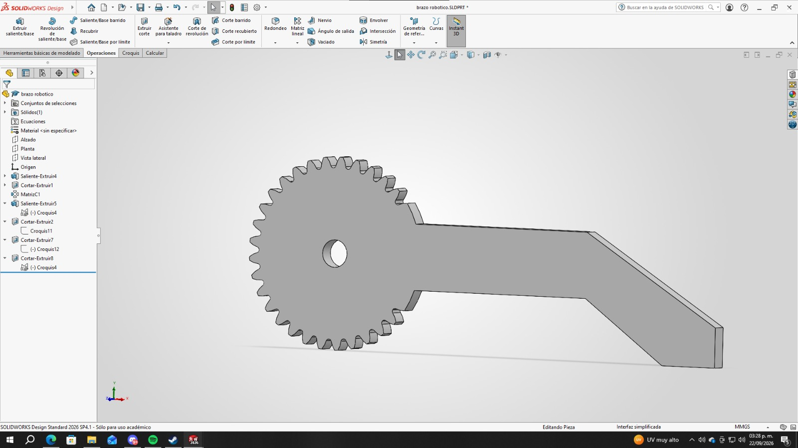 
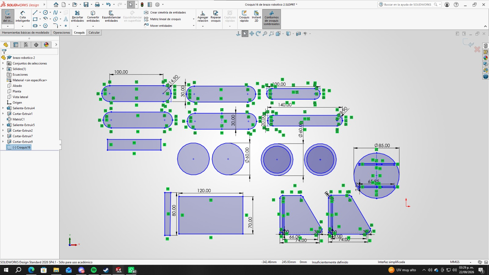 
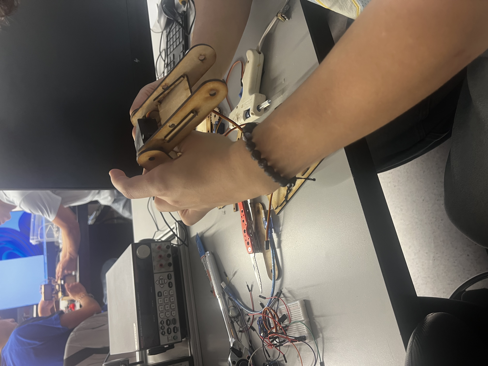 
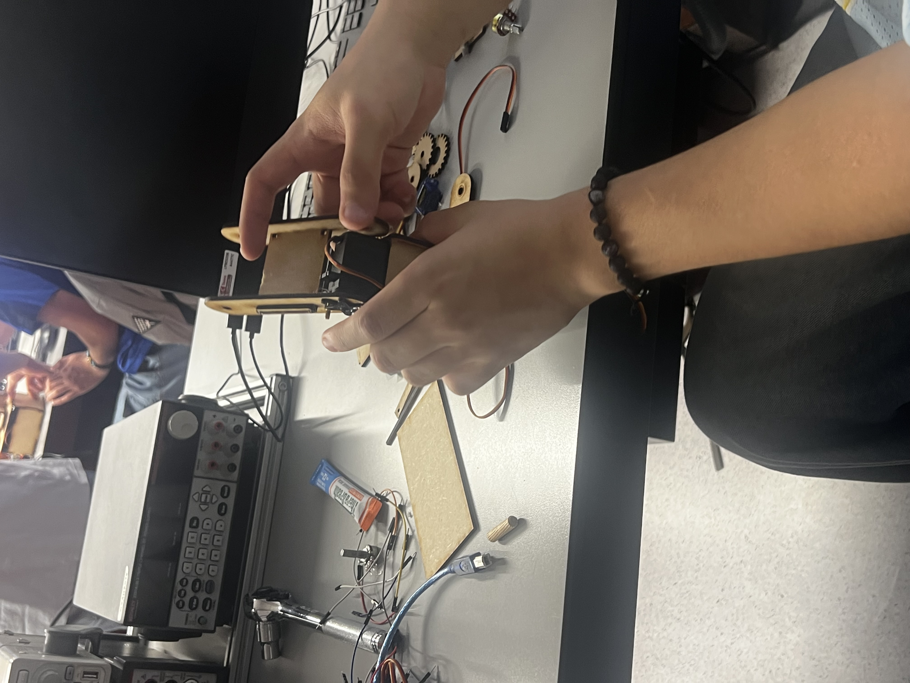 
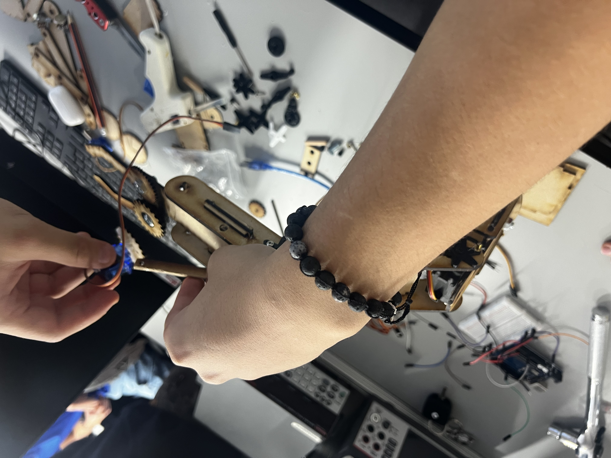 
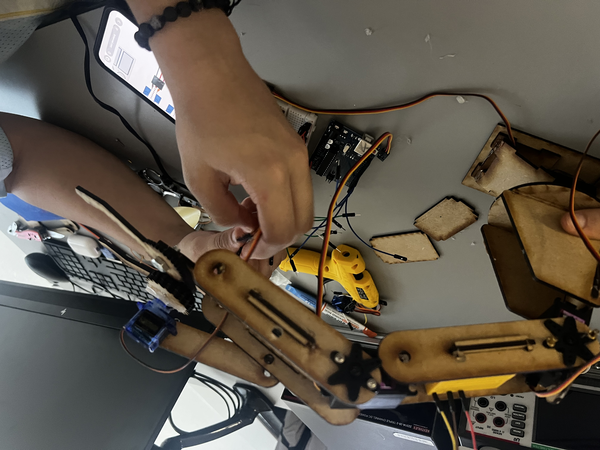 
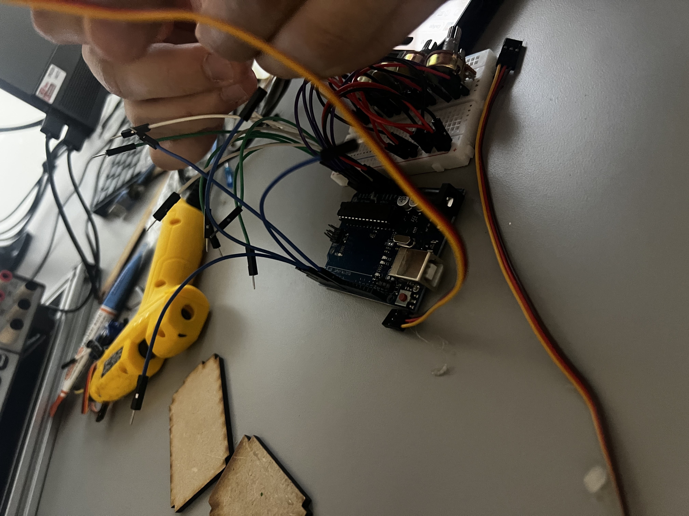 
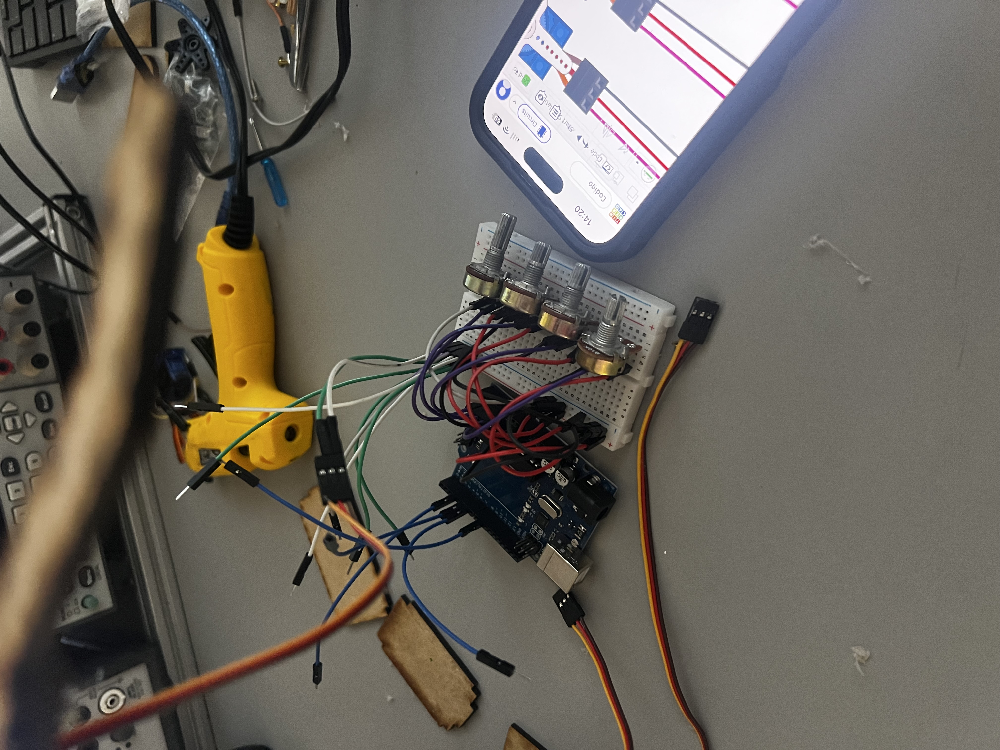 
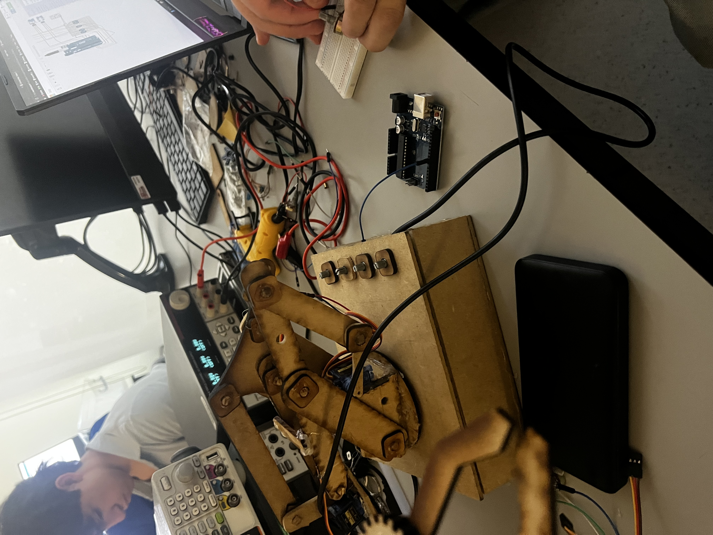 
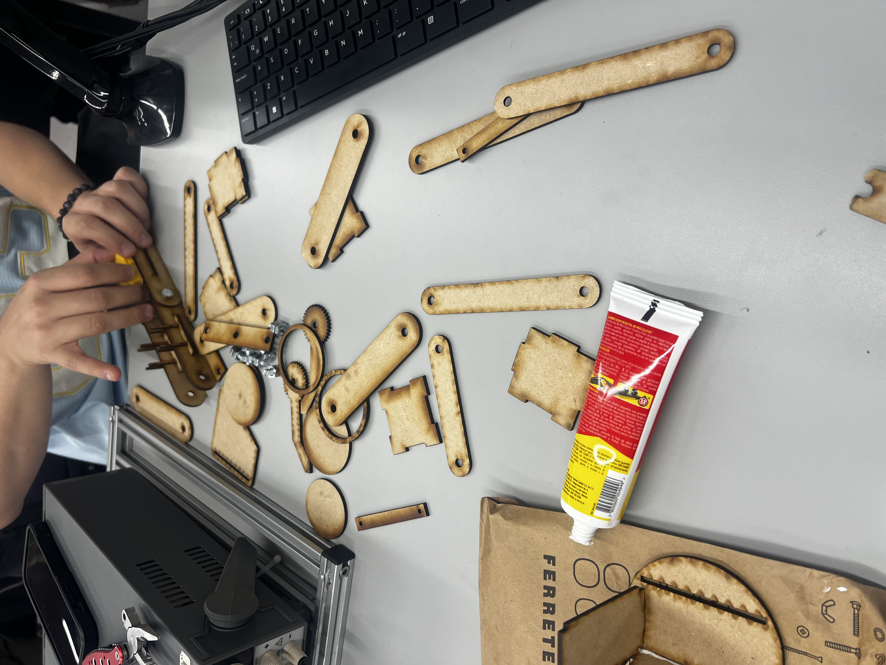 
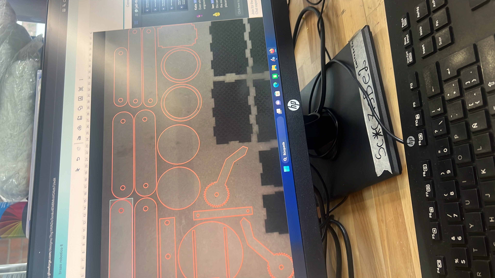 

Y finalmente, los videos en los que nuestro brazo sostiene la pelota y logra pasarla al brazo de el equipo de nuestros compañeros:
 
 

